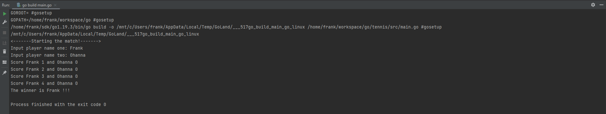

# Play Tennis

Tennis is a sport of English origin, played on courts that are generally open and in which players participate in the game.
two opponents or two pairs of opponents. The court is divided into two half-blocks by a net and the goal
of the game is to hit a small ball beyond the net (towards the opponent's half-court) with the help of a racket.
To score a point, the ball must touch the ground anywhere within the opponent's court, making
with the opponent not being able to return the ball before the second touch or that he returns it out of bounds
another half block. <br>



## Getting started

You need to install in your compute Go 1.19.3 or latest version.

```shell
# Clone this repository
$ git clone <https://github.com/franklaercio/tennis.git>

# Go to the directory
$ cd tennis/src

# Run the project
$ go run main.go
```

## Considerations

For the sake of simplicity, assume that the match has a single set composed of a single game,
winning the game the player who reaches a fixed number of points P of that game.

## Contributors
- Frank Laércio - [github.com/franklaercio](https://github.com/franklaercio)
- Ohanna Dezidério - [github.com/ohannadeziderio](https://github.com/ohannadeziderio)

## License

This project is licensed under the MIT License - see the LICENSE.md file for more information.